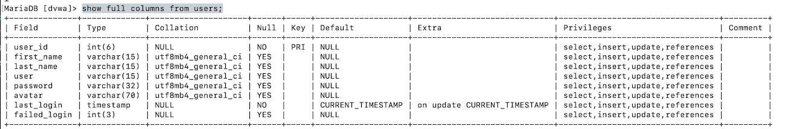
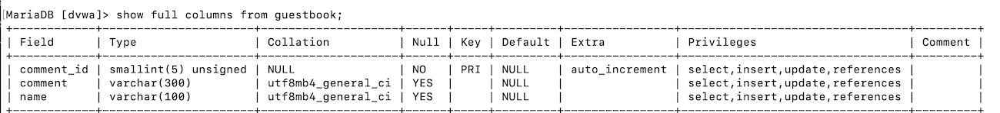
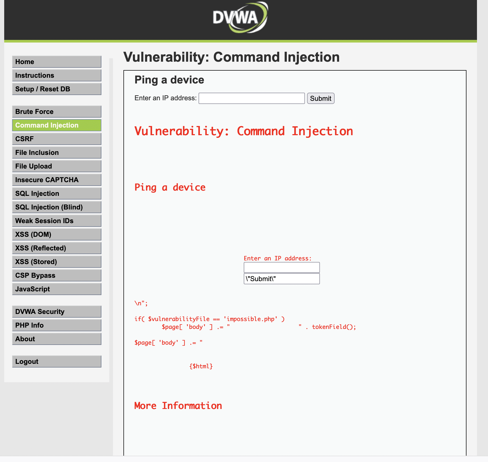

# 課題1

## それぞれの脆弱性の仕組み、被害、対処法

### XSS
クロスサイトスクリプティング。<br>攻撃対象のサイトに対して、悪質なサイトへ誘導（サイトをクロスする）するスクリプトを仕掛け、サイトに訪れたユーザーの個人情報を搾取するなどを実施する
IPA（情報処理推進機構）の調査では2020年3期では半数以上の被害が発生しているなど、多くの件数が発生している。<br>
https://www.amiya.co.jp/column/cross_site_scripting_20210118.html<br>
Twitterやyoutubeなど、有名なサイトでの報告事例もある

<br>
◼️対処法<br>

◼️入力値の制限<br>
たとえば郵便番号を入力するフォームでは、数字以外の文字種を入力できないように制限する、<br>
ID・パスワードを入力するフォームでは半角英数字●文字までしか入力できないなどの制限をするなど<br>
入力内容に応じて入力値を制限する方法があります。<br>

◼️サニタイジング<br>
フォームに、スクリプトの構成に必要になるような文字が入力された場合に、その文字を他の文字へ書き換える手法です。<br>
例　「<」 は「&lt;」に変換。「>」は 「&gt;」に変換するなどの方法です。
<br>

◼️WAF設定<br>
サーバーやネットワーク機器で利用するサービスとして提供されているWAF設定を利用する<br>

参考
https://www.amiya.co.jp/column/cross_site_scripting_20210118.html<br>
https://www.kagoya.jp/howto/network/xss/

### コマンドインジェクション
OSコマンドを呼び出せる様々な言語で実施できる脆弱性攻撃。<br>
Cookie やフォームのデータ、URL のクエリパラメーターといった、ユーザーから提供されたデータの一部を使ってオペレーティングシステムコマンドを実行する攻撃です。<br>
この攻撃により、サーバ内に保存されているファイルを読み出したり、システムに関係する操作、プログラムを不正に実行することが可能になります。<br>
情報の改竄、サーバー内ファイルの変更、データベースの破壊など、実行権限を高い権限で乗っ取られるほどに危険性が高いです。<br>
<br>
◼️対処法<br>
安全なプラットフォーム API やクライアントライブラリを利用す流、侵入検知システムの導入などを検討する。<br>
WebアプリケーションからOSコマンドを呼び出さないようにする。例として言語によりOSコマンドを呼び出すことができる代表的な関数・メソッドがあるため、それらを利用している箇所を洗い出し、代替えの方法がないかを検討する。<br>
また入力情報により発生するため、フォームのバリデーションを厳格に行う。

### SQLインジェクション
文字通り、不正なSQLを注入することで、データベースを操作する処理のことを指します。<br>
例として、サイト内をキーワードで検索できるフォームがあり、攻撃者がそのフォームへ不正な内容を盛り込んだSQL文を入力し検索を行うことで、そのSQL文の内容が実行される、というものがあります。<br>
データベース内部にアクセスできることで、重要な機密情報が漏洩したり、サイトを改竄したりすることが可能です。
<br><br>
◼️対処法<br>
対策としては、プログラム的な意味合いを持つ文字列を置き換えるエスケープ処理、<br>
SQLにおいては検索文字などに静的プレースホルダを使う、<br>
Web Application Firewall(WAF)を導入する、<br>
脆弱性診断サービスを導入するなどの方法があります。


### CSRF
クロスサイトリクエストフォージェリ。<br>ユーザーが意図しない、望んでいないアクションを強制的に実行させる。
XSSは掲示板など、フォームの脆弱性を狙ったものだが、CSRFはセッション管理における脆弱性を狙う。

セッション管理に脆弱性のあるwebサイトに罠を仕掛け、対象のユーザーをそこに誘導。<br>
攻撃用のリクエストURLをクリックさせ、脆弱性のあるwebサイトに、強制書き込みや改竄などの不正な操作を実施する。対象ユーザーのセッションidを利用して行います。<br>

◼️対処法<br>
・ユーザー側の対策<br>
使用していない時はサービスからログアウトする、ブラウザにパスワードを記憶させない<br>

・アプリ側の対策<br>
トークンを利用する。ユーザーのセッション情報に一意のトークンを持たせ、サーバー側で保持している情報と一致しなければ不正なリクエストとして除外します。<br>

・SameSite=Lax や SameSite=Strictの追加<br>
SameSite=Lax や SameSite=Strictをhttpヘッダーに指定する方法があります。<br>


# 課題2
## クイズ！
SQLインジェクションは、フォームの入力欄にSQLを操作するような文字列を入力し実行できてしまい、それによりデータベースの操作ができてしまう脆弱性です。<br>
とはいえ、そのようなサイトを悪い人が見つけても、サービスのデータベースの各種テーブル名がわからないと、効率的に攻撃することはできません。<br>
しかし、SQLインジェクションに対する脆弱性のあるサイトについてはテーブル名を取得する方法も別途あったりします。そのためにはどのような情報を利用するのでしょうか。<br>
（具体的な例、SQLではなく、概要、または名称がわかればOKです！）


# 課題3
dockerで実施。<br>
docker run --rm -it -p 80:80 vulnerables/web-dvwa
で該当のコンテナをスタート。
adminとpasswordでログイン
create databaseで数秒するとデータベースが作成され再度ログイン画面にアクセスします。、メニューがサイドに作成されます。

メニューの「sqlインジェクション」で色々な情報を見てみましょう。
```
 1' OR 'a'='a
```
を入れることで全ユーザー名を確認。sqlインジェクションの脆弱性があることがわかります。
```
' union select table_name,table_schema from information_schema.tables where table_schema = 'dvwa' #
```
でテーブル名guestbookとuserが確認できました。

続いて、
```
' union select table_name,column_name from information_schema.columns where table_schema = 'dvwa' and table_name = 'users' #
```
でusersテーブルの全カラムが取得できます。

### mysqlを起動
別ターミナルでdockerのコンテナ環境に入る（コンテナが起動している必要がある）
docker exec -it silly_kalam(コンテナ名) bash
コンテナから抜ける
exit 

そのまま　コンテナ内で
mysql -u root -p
でmysqlにログイン。パス入れずに。
show databasesで一覧が取得。dvwaが対象のデータベースと思われる。
use database名;で該当dbを選択。今回は use dvwaを選択。
show tables;で現在いるdbのテーブルを取得。
guestbookとuserテーブルが取得できます。

show full columns from users;　またはguestbook でテーブル一覧が取得。テーブル名が一致していることが確認できました。
sqlインジェクションによりテーブル情報が取得できている状態です。

ユーザーズ

ゲストブック


参照：
https://qiita.com/y-araki-qiita/items/131efa82c4205e83fef8
https://www.dbonline.jp/mysql/database/index3.html

<br>
次はコマンドインジェクションです。
メニューから
Command Injection
を選び、ipを入力します。
60.120.178.69

なお、画面右下の「View Source」を見ると、phpのshell_exec() という処理を実行しています。
単にipを入力するのではなく、その後に;pwdと入れると現在地がわかってしまいます。

そのほか、
60.120.178.6; ls と入れると、存在しているファイル一覧。
index.phpがあったため、
60.120.178.6 cat;index.php
と入れると、このファイル自体を画面に表示してしまいます。

コマンドインジェクション



参照
https://cysec148.hatenablog.com/entry/2019/11/02/105230


フロントで情報を持ちたくない。
リッチなフロントにしたい場合に試してみたい。
uxを実現したいときなど。
1対1でモデリングさせたりなどは

◼️メリット
両方の整合性を求められない
フロントにはアホでいてほしい。

プラハの場合、小規模なことが多い。ので、なおさら。
use

>cache-control: max-age=nをリクエストヘッダとレスポンスヘッダにつける場合の違いについてお聞きしたいです。
>仮に両者が競合するとしたらどういった挙動になるのでしょうか？

リクエスト
5.2.1.1

レスポンス
5.2.2.8

ブラウザからはキャッシュを送らないようにしている？デフォルトでmax-ageは0

松原さんの伝えておいたほうがいいかも。
4-2-2
メルカリの事例があったよ/キャッシュの事例
アナリティクスなどはファーストパーティクッキー

フロントでどういう時にクッキーを